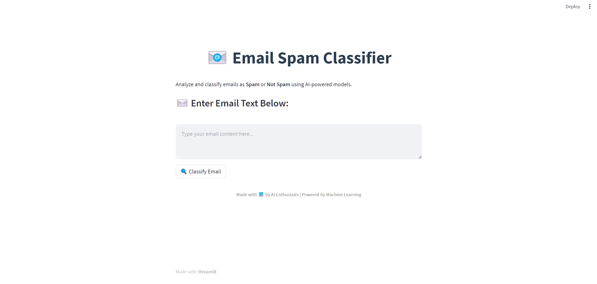

# Email Spam Detection System

## 🚀 Overview

This project aims to build a robust machine learning model for detecting spam in emails. By leveraging advanced text preprocessing techniques and classification algorithms, the system accurately classifies emails as spam or not spam. A user-friendly interface built with Streamlit allows for easy interaction with the model.

![Spam Detection]  <!-- Add an image relevant to your project -->

## 🛠 Features

- **Text Preprocessing**: Includes text normalization, tokenization, removal of stopwords, and stemming.
- **Feature Extraction**: Utilizes TF-IDF (Term Frequency-Inverse Document Frequency) for vectorizing text data.
- **Model Training**: Logistic Regression model optimized through GridSearchCV.
- **Interactive Interface**: Streamlit-based web app for real-time spam detection.

## 💻 Technologies Used

- **Programming Language**: Python 3.8+
- **Data Processing**: Pandas, NumPy
- **Text Preprocessing**: NLTK (Natural Language Toolkit), Regex
- **Feature Extraction**: Scikit-learn (TF-IDF Vectorizer)
- **Model Training**: Scikit-learn (Logistic Regression, GridSearchCV)
- **Web Application**: Streamlit
- **Visualization**: Matplotlib, Seaborn, WordCloud
- **Model Persistence**: Pickle

## 🌟 Getting Started

### Prerequisites

- Python 3.9+
- Necessary Python libraries (specified in `requirements.txt`)
